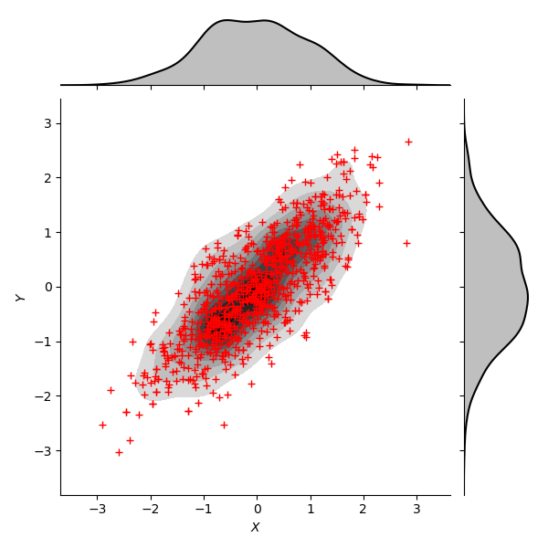
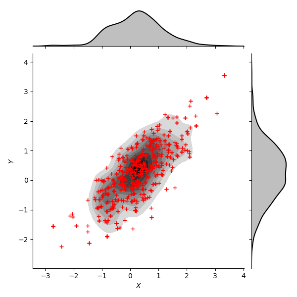

# hamiltonian_montecarlo
Repository for Hamiltonian Monte Carlo for Deep Neural Networks (Work in progress!)

Dependencies : 

    Numpy
    HDF5

Optional :

    Keras
    skcuda

Get data from :

    cd data/
    # original MNIST dataset in HDF5 format
    wget http://www.geoespacial.ucm.cl/data/mnist.tar.gz
    tar -zxvf mnist.tar.gz
    # Convolutional features from the Plant Village Dataset 
    # https://github.com/spMohanty/PlantVillage-Dataset
    wget http://www.geoespacial.ucm.cl/data/plants.tar.gz
    tar -zxvf plants.tar.gz
    
Run

    python benchmark/mvn_gaussian/test_hmc.py
    
    python benchmark/mvn_gaussian/test_metropolis.py
    
